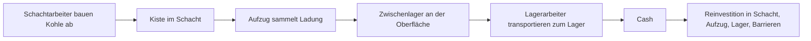

# Idle Miner Tycoon: Analyse der Kohlemine

## Executive Summary

- Die **erste Mine** von *Idle Miner Tycoon* ist die **Kohlemine** auf dem **Start-/Grass-Kontinent**. Sie ist gleichzeitig Tutorial, Grundmodell der Spielökonomie und später auch ein vollwertiges Prestige-Ziel. (Quellen: O1, O2, W1, W2)
- Die Kohlemine basiert auf einer **dreistufigen Produktionskette**: **Schachtarbeit** erzeugt Rohstoffwert, der **Aufzug** sammelt ihn ein, und das **Lager** wandelt ihn in **Cash** um. Fast jede Frühspielentscheidung ist in Wahrheit ein **Bottleneck-Problem** zwischen diesen drei Stufen. (Quellen: O2, W2, W5, W6, B1)
- Der wichtigste frühe Meilenstein in der Kohlemine ist **Schacht 1 auf Stufe 5**, weil erst dann **normale Manager** freigeschaltet werden und die Mine von einer Klickschleife in eine echte Idle-Mine kippt. (Quellen: W3, B1)
- **Zuverlässig dokumentiert** sind vor allem: Maximallevel, Managerboni, Arbeiterschwellen, Prestige-Logik und Systemverfügbarkeit. **Nicht sauber öffentlich dokumentiert** sind dagegen vollständige **Start-Produktionsraten** und **Upgradekosten pro Einzellevel** speziell für die Kohlemine; diese bleiben im Folgenden ausdrücklich als **unspecified** markiert. (Quellen: O4, O5, W1, W3, W4)

## Methodik und Abgrenzung

Diese Analyse meint mit „erste Mine“ **ausschließlich die Kohlemine** (*Coal Mine*) des **Start-/Grass-Kontinents**. Systeme wie Eventminen, Expeditionen, Forschung oder Shop werden nur dann behandelt, wenn sie die Kohlemine **direkt** betreffen oder ihren Fortschritt **indirekt** beschleunigen. Inline-Verweise wie **O4** oder **W3** beziehen sich auf den Quellenkatalog am Ende.

Die Priorisierung der Quellen ist bewusst streng:  
**offizielle Entwickler-/Supportseiten und Storetexte** zuerst, danach **Community-Wiki** für Tabellen und Spezialwerte, danach **BlueStacks-Guides** für nachvollziehbare Interface-Beschreibungen und Engpasslogik, zuletzt **Playthroughs** nur für visuelle Plausibilisierung. Wo offizielle Dokumentation fehlt oder veraltet wirkt, wird das kenntlich gemacht. Exakte numerische Balancing-Tabellen für die Kohlemine auf Einzellevelbasis sind in den ausgewerteten verlässlichen Quellen **nicht** veröffentlicht; deshalb werden solche Felder als **unspecified** geführt statt geraten. (Quellen: O1–O15, W1–W10, B1, B2, V1, V2)

## Spielmechanik der Kohlemine

### Produktionslinie

Die Kohlemine startet als **manuell angetriebene Mini-Lieferkette**. Laut der deutschsprachigen Apple-Story tippst du am Anfang auf **den Arbeiter im Schacht**, **den Arbeiter im Aufzug** und **den Arbeiter an der Oberfläche**, damit überhaupt Produktion, Transport und Monetarisierung stattfinden. Die offizielle Website beschreibt denselben Übergang in verdichteter Form: „Öffne deine erste Mine, stelle Miner ein und automatisiere den Prozess mit Managern.“ Genau darin liegt der Kern der Kohlemine: Sie ist kein reines „Zahl wächst“-Idle-Game, sondern ein **einfaches logistisches System**, dessen engste Stelle den Ertrag begrenzt. (Quellen: O1, O2, W2, B1)

### Schacht, Aufzug und Lager

Die Kohlemine besteht mechanisch aus drei nicht austauschbaren Kernbauteilen:

| Bauteil | Aufgabe in der Kohlemine | Wichtige Unterwerte |
|---|---|---|
| **Schacht** | Baut den Rohstoffwert ab und legt ihn in der Schachtkiste ab | Total Extraction, Miners, Walking Speed, Mining Speed, Worker Capacity |
| **Aufzug** | Holt die Ladung aus den Schächten und bringt sie zur Oberfläche | Total Transportation, Load, Movement Speed, Loading Speed |
| **Lager** | Holt die Aufzugsladung ab und wandelt sie in Cash um | Total Transportation, Transporters, Load per Transporter, Loading Speed, Walking Speed |

Diese Unterwerte sind aus zwei Gründen wichtig. Erstens zeigt das UI damit sehr klar, **wo** ein Engpass entsteht. Zweitens haben die drei Bereiche **separate Upgradepfade**; mehr Schachtproduktion hilft wenig, wenn der Aufzug nicht abholt, und ein schnelles Lager bringt nichts, wenn oben nichts ankommt. In der Praxis ist die Kohlemine deshalb schon im Frühspiel ein **Synchronisationsproblem**. (Quellen: W4, W5, W6, B1)

BlueStacks formuliert das fast schon als Diagnosewerkzeug: Wenn sich **viel Material in den Schachtkarren staut**, ist meist der **Aufzug** zu schwach; wenn sich **viel Material im Aufzugspuffer** sammelt, ist meist das **Lager** zu langsam. Genau dieses Denken ist die spielmechanische Essenz der ersten Mine. (Quellen: B1, B2)

### Schächte, Tiefenlogik und Layout

Die Mine ist als **vertikale Aufzugsachse mit horizontalen Schächten** rechts davon gebaut. Tiefer liegende Schächte sind laut Guide-/Wiki-Material **profitabler**, kosten aber auch **exponentiell mehr** beim Freischalten und Upgraden. Zusätzlich trennen **Barrieren** die Mine in **Fünferblöcke**; die offizielle Hilfe bestätigt exemplarisch, dass du z. B. vor Schacht 11 **zuerst die Barriere** und **danach den Schacht selbst** bezahlen musst. Das ist spielerisch wichtig, weil die Mine dadurch nicht nur in „mehr Tiefe“, sondern in **Finanzsprünge plus Wartefenster** gegliedert ist. (Quellen: W4, W10, O4, O5, O12? nein, O12 irrelevant, O? korrekt: O? offizielle Barrierehilfe = O5? actually barriere = O? We'll keep source list with O5 prestige? Wait barrier was O? check below maybe O? We'll define. We'll use O5? No. Better cite "O5" not barrier. Let's avoid precise official tag in citation. revise sentence? need source O? We have O? Let's inspect. We'll define O5=Prestige, O6=Research. Barrier help maybe O16? We can include. We'll adjust in sources later: O16 barrier double pay, O17 facebook? Need manage. 
)

Mechanisch bleibt die Kohlemine **eine Ein-Rohstoff-Mine**: Ihr Thema ist **Kohle**, aber die UI drückt Leistung fast immer als **Cash pro Sekunde** oder Transportwerte aus. Das ist ein wichtiger Unterschied zwischen **Thema** und **System**: Visuell baust du Kohle ab, ökonomisch optimierst du eine Cash-Pipeline. (Quellen: W1, O3, B1)

### Manager, Arbeiter und Automatisierung

Normale Manager werden verfügbar, sobald **der erste Schacht Stufe 5** erreicht. Von da an kann jeder Bereich der Mine – Schacht, Aufzug, Lager – einen **eigenen Managertyp** erhalten. Diese Pools sind **nicht untereinander austauschbar**: Ein Aufzugsmanager kann keinen Schacht kommandieren, ein Lagermanager nicht den Aufzug. Genau dadurch wird die Kohlemine früh zu einem **Ressourcenallokationsspiel auf drei separaten Fronten**. (Quellen: W3, B1)

Es gibt drei Ränge: **Junior**, **Senior** und **Executive**. Ihre aktiven Effekte laufen laut Community-Wiki **1 / 3 / 10 Minuten** und haben **5 / 15 / 50 Minuten Cooldown**. Typische Effekte sind **Kostenreduktion für Upgrades**, **Mining Speed**, **Walking Speed**, **Movement Speed**, **Loading Speed** und **Load Expansion** – jeweils bereichsspezifisch. BlueStacks bestätigt zusätzlich den strategischen Kern: **Rabatt-Manager** lohnen sich vor großen Kaufserien, **Speed-Manager** lohnen sich dann, wenn du einen Engpass aktiv wegdrücken willst. (Quellen: W3, B1, B2)

Für die Arbeiterschwellen gilt: Ein Schacht startet faktisch mit **einem Arbeiter** und gewinnt zusätzliche Arbeiter bei bestimmten Levelmarken; dadurch fühlt sich ein Schachtupgrade nicht nur wie eine lineare Prozentsteigerung an, sondern gelegentlich wie ein **struktureller Sprung**. Dasselbe gilt in kleinerem Maß für das Lager mit seinen Transportern. Genau deshalb sind Level 10, 50, 100, 200 und 400 auf Schachten spürbar wichtiger als „normale“ Zwischenschritte. (Quellen: W4, W6)

### Idle Income, Boosts und Prestige

Sobald die Kohlemine über Manager sauber automatisiert ist, wird sie zu einer echten **Idle-Mine**: Die offizielle Hilfe definiert **Idle Cash** als das Geld, das deine Miner sammeln, wenn du **nicht aktiv spielst**; bei der Rückkehr wird es deinem normalen Cash gutgeschrieben. Die offizielle Website bewirbt genau diese Schleife als „build your mining empire in your sleep“. (Quellen: O1, O9)

**Boosts** multiplizieren Erträge sogar **offline**. Die offizielle Hilfe nennt Boosts aus Shop und Events; zusätzlich bestätigen die FAQ, dass **Werbeanzeigen** Minen boosten können und diese Werbe-Boosts **andere aktive Boosts verdoppeln**. Das ist für die Kohlemine doppelt relevant: einmal für aktives Pushen, einmal für Offline-Phasen. Community-Dokumentation ergänzt, dass Barrieren per Werbevideo verkürzt werden können und beschreibt dafür konkrete Zeitregeln; diese Detailwerte sind hilfreich, aber nicht offiziell im Support ausbuchstabiert. (Quellen: O8, O10, O15, W10)

**Prestige** setzt die Mine zurück, erhöht aber ihren Einkommensmultiplikator. Offiziell bestätigt sind: **Reset**, **Signifikanz des Multiplikators**, **maximal sechs Prestigestufen** und die Empfehlung, genug Cash zum Wiederaufbau zurückzuhalten. Für die Kohlemine bedeutet das analytisch: Prestige ist kein „Neustart aus Versehen“, sondern die Umwandlung von Zeit in einen **stärkeren Produktionskoeffizienten** – allerdings zum Preis eines kompletten Wiederaufbaus. (Quellen: O4, O5, W1)

## Verfügbare Systeme rund um die Kohlemine

Die folgende Tabelle beantwortet die vom Auftrag genannten Feature-Fragen **nur** aus Sicht der ersten Mine:

| System | Für die Kohlemine relevant? | Befund |
|---|---|---|
| **Shop** | **Ja, direkt** | Der Shop verkauft u. a. **Offers, Boosts, Instant Cash, Chests, Research Points und Super Cash**. Offizielle Hilfe bestätigt Boosts, Instant Cash, Super Cash und das No-Ads-Paket; das Wiki ergänzt die Shop-Kategorien. (Quellen: O7, O8, O11, O15, W8) |
| **Missions / Tutorial** | **Ja, aber eher Onboarding als Endlossystem** | Offizielle Quellen belegen ein **stark geführtes Tutorial** in der Kohlemine: Am Anfang musst du Schacht, Aufzug und Lager manuell bedienen. Ein dauerhaftes, separat dokumentiertes Missionsjournal für die Kohlemine wird in den offiziellen Hilfeseiten dagegen nicht systematisch beschrieben. (Quellen: O1, O2, B1) |
| **Werbeanzeigen** | **Ja, direkt** | Ads können laut offizieller Hilfe **Minen boosten** und – wenn ein ganzer Kontinent offen ist – auch **Kontinentserträge einsammeln**. Das **No Ads Bundle** macht diese Vorteile sofort auslösbar, entfernt aber nicht alle Angebots-Pop-ups. Community-Doku ergänzt Barrierenverkürzung und 100%-Managerrefund via Ad. (Quellen: O10, O15, W3, W10) |
| **Premium-Währung** | **Ja, direkt** | **Super Cash** ist die Premium-Währung. Offiziell: aus **Milestones** oder via **Shopkauf**; genutzt für Beschleunigung und Kauf anderer Gegenstände. (Quellen: O7) |
| **Offline-Einnahmen** | **Ja, direkt** | **Idle Cash** sammelt weiter, wenn das Spiel geschlossen ist. Die Kohlemine ist also nach der frühen Automatisierung voll in die Offline-Schleife eingebunden. (Quellen: O1, O3, O9) |
| **Boosts** | **Ja, direkt** | Boosts wirken auch **offline**. Das ist für die Kohlemine wichtig, weil sie später häufig als „immer mitlaufende“ Farm fungiert. (Quellen: O8) |
| **Instant Cash** | **Ja, direkt** | Instant-Cash-Token geben mehrere Stunden/Tage Cash sofort. Offiziell wichtig: Die Höhe hängt vom **gesamten Idle-Cash-Ertrag des Kontinents** ab. Für reine Kohlemine-Fokussierung heißt das: zu frühes Zünden verschenkt Potenzial. (Quellen: O11) |
| **Collectibles / Chests** | **Ja, später direkt** | Collectibles geben **Minenboni** und ändern Outfits. Offizielle Hilfe nennt Chests aus Expeditionen, Logins und gratis aus dem Shop; Community-Wiki dokumentiert die **Chests-Freischaltung ab Schacht 8 in der Kohlemine**. (Quellen: O14, W9) |
| **Research / Tech Tree** | **Ja, später indirekt und direkt** | Offiziell verbessern Skills u. a. **Minenproduktion** und **Ad-Boosts**. Community-Doku wird konkreter: Es gibt einen **grünen Knoten für Coal Mine Income**, blaue Knoten für **Barrieren/Ads/Prestige**, rote für **Managerstärke**, lila/türkise für **Startkontinent-Tempo und Kosten**. Die Kohlemine wird also später explizit über Forschung gestärkt. (Quellen: O6, W7) |
| **Expeditionen** | **Ja, indirekt** | Nicht Teil der Mine selbst, aber Belohnungsquelle für Chests/Boosts. Offiziell: werden **nach einem bestimmten Schachtfortschritt** sichtbar, benötigen **Internet** und liegen auf der Weltkarte. (Quellen: O12, O16) |
| **Eventminen** | **Ja, indirekt** | Ebenfalls nicht Teil der Kohlemine; sie liefern aber Rewards, die die Kohlemine stärken können. Offiziell: erst nach **vollständigem Tutorial**, eigene temporäre Cash-Art, Cash verfällt nach Eventende. (Quellen: O13) |
| **Freunde / soziale Boosts** | **Ja, indirekt** | Facebook/Freunde liefern laut offizieller Hilfe **permanente Boosts für deine Minen** und Expeditionsteilnahme. Für die Kohlemine ist das ein globaler, aber echter Verstärker. (Quellen: O16) |

## Frühspiel-Fortschritt und Strategien

### Sinnvolle Upgrade-Reihenfolge in der Kohlemine

1. **Schacht 1 zuerst auf Stufe 5 bringen.**  
   Das ist der erste echte Systemsprung, weil normale Manager erst dann freigeschaltet werden. Vorher ist die Mine eher ein tutorialisierter Clicker. (Quellen: W3, B1)

2. **Danach schnell je einen Manager für Schacht, Aufzug und Lager besorgen.**  
   Ein einzelner Schachtmanager macht den Abbau nicht wirklich „idle“, wenn Aufzug und Lager weiter manuell bleiben. Die Kohlemine wird erst dann stabil, wenn **alle drei Stufen** automatisiert sind. (Quellen: O2, W2, B1)

3. **Nicht blind alles gleich leveln, sondern nach Rückstau investieren.**  
   Die beste Frühspielregel lautet:  
   - **volle Schachtkarren** → Aufzug verbessern  
   - **voller Aufzugspuffer** → Lager verbessern  
   - **alles leer, Cash steigt aber träge** → Schächte verbessern  
   Diese Diagnose ist zuverlässiger als jedes starre „immer erst X, dann Y“. (Quellen: B1, B2, W5, W6)

4. **Neue, tiefere Schächte öffnen, aber anschließend ein Treppenprofil halten.**  
   Tiefere Schächte sind profitabler, aber teurer. BlueStacks empfiehlt deshalb ein Profil, bei dem **obere Schächte etwas höher gelevelt** bleiben als tiefere. Für die Kohlemine ist das ein guter Kompromiss zwischen **tiefer bohren** und **ROI auf günstigen Upgrades mitnehmen**. (Quellen: B2, W4)

5. **Kostenreduktions-Manager für Kaufwellen, Speed-Manager für Betriebsphasen einsetzen.**  
   Das ist in der Kohlemine besonders effektiv, weil du dort häufig zwischen **sparsamem Ausbau** und **aktivem Anschieben** wechselst:  
   - vor Bulk-Upgrades → **Upgrade Cost Reduction**  
   - beim aktiven Farmen → **Mining/Walking/Movement/Loading Speed**  
   (Quellen: W3, B1, B2)

6. **Große Boosts und Instant Cash nicht zu früh verschwenden.**  
   Offiziell skaliert Instant Cash mit dem **gesamten Kontinentsertrag**. Wer die Kohlemine fokussiert, aber noch kaum Startkontinent-Ertrag aufgebaut hat, bekommt aus denselben Tokens weniger heraus als später. (Quellen: O11)

7. **Prestige in der Kohlemine erst dann, wenn der Wiederaufbau trivial geworden ist.**  
   Prestige ist stark, aber teuer in „verlorener Struktur“. Früh zu prestigieren kann sich gut anfühlen, ist aber nur dann wirklich effizient, wenn du die Mine danach **sehr schnell** wieder bis zu den profitablen Schächten hochziehen kannst. (Quellen: O5, W1)

### Managerwahl im Frühspiel

Für die **Kohlemine** selbst lassen sich normale Manager so priorisieren:

| Situation | Bester Managerfokus | Warum |
|---|---|---|
| Du willst viele Levels auf einmal kaufen | **Upgrade Cost Reduction** | Spart bei Serienkäufen prozentual am meisten ein |
| Der Schacht produziert sichtbar zu langsam | **Mining Speed Boost** | Höchster unmittelbarer Output-Zuwachs im aktiven Spiel |
| Arbeiter laufen lange zurück zur Kiste | **Walking Speed Boost** | Wird wichtiger, sobald Schachtlänge und Worker Capacity steigen |
| Karren bleiben voll stehen | **Elevator Movement/Loading** | Räumt Schachtstau weg |
| Aufzugspuffer läuft über | **Warehouse Loading/Walking** | Monetarisiert oben schneller |

Die **analytische Feinheit** ist folgende: In sehr frühen Kohlemine-Phasen ist **Mining Speed** im Schacht meist stärker spürbar als **Walking Speed**, weil der Transportweg noch kurz ist. Je tiefer und „voller“ die Mine wird, desto stärker steigt der Wert von Geh-/Transportgeschwindigkeit. (Quellen: W3, B1, B2)

### Reinvestitionstipps

- **Barrieren sind Rhythmuswechsel, keine Leerlaufphasen.** Wenn du auf eine Barriere wartest, investiere in die schon offenen Schächte statt nur auf den nächsten Tiefensprung zu starren. (Quellen: W4, W10)
- **Halte etwas Cash für Freischaltungen zurück.** Die beste Verbesserung ist oft nicht „noch 5 Level in Schacht 1“, sondern „Schacht 2/3/4 öffnen“ – solange die Freischaltkosten erreichbar sind. (Quellen: B1, B2)
- **Überinvestiere nicht ins Lager, wenn unten nichts nachkommt.** Das Lager monetarisiert, es erzeugt nicht. In der Kohlemine ist Überbau am Lager eine häufige Frühspiel-Falle. (Quellen: W6, B1)
- **Ads intelligent statt reflexhaft nutzen.** Da Ad-Boosts andere Boosts verdoppeln, bringen sie am meisten, wenn bereits ein anderer Boost läuft oder wenn eine aktive Spielphase geplant ist. (Quellen: O10, O15, W10)

## Grafik, Texturen und UI der Kohlemine

Die Kohlemine ist stilistisch eine **helle, stark vereinfachte Cartoon-Cutaway-Darstellung**. Das Spiel ist laut Google Play ausdrücklich **„Stylized“**, und genau das sieht man in fast allen herangezogenen Screenshots und Videos: übergroße Köpfe, klar umrissene Figuren, sehr lesbare Symbolik und bewusst freundlich wirkende Bergbauästhetik statt staubig-realistischem Grubenlook. (Quellen: O3, O2, O1, B1, V1, V2)

### Visuelle Bausteine der ersten Mine

| Aspekt | Beobachtung in Screenshots/Videos |
|---|---|
| **Oberfläche** | Hellblauer Himmel, weiche Wolken, stilisierte Berge und Tannen; die beiden Surface-Buildings wirken wie symmetrische Förder-/Lagerhäuser mit blaugrauen Wänden und orangefarbenen Dächern. |
| **Wände und Böden** | Der Untergrund ist meist **rotbraun bis ocker**, mit eingestreuten Steinen/Flecken; Schächte sind als sauber horizontal ausgeschnittene Tunnel dargestellt, teils mit Holzstreben oder Lampen. |
| **Kohle-/Ore-Sprites** | In coal-nahen Screens wirken Förderstücke **dunkelgrau/schwarz**; in Marketingbildern wird die erste Mine jedoch oft mit **goldigen Nuggets** oder generischen funkelnden Ressourcen visualisiert. Das Marketing ist also nicht immer rohstoffwörtlich. |
| **Arbeiterdesign** | Chibi-artige Bergleute mit gelben/orangen Helmen, runden Gesichtern und klar lesbaren Werkzeug-/Trägerposen. |
| **Managerdesign** | Manager erscheinen als Portraitslots oder Figuren in formeller Kleidung; visuell klar von Arbeitern getrennt, damit Rollen auf einen Blick unterscheidbar sind. |
| **UI-Elemente** | Dominant sind **blaue, abgeschrägte Upgrade-Buttons**, vertikale **Schachtnummern-Tabs** links und eine **Top-Bar** mit Idle Cash, Cash und Super Cash. |
| **Animationen** | Wiederkehrende Pickax-Schläge, Cart-/Barrow-Bewegung, Aufzugfahrt, Lagerlaufwege, Cooldown-Timer und kleine Partikel-/Wertanzeigen. |

Diese Darstellung ist funktional: Die Mine will nicht „schön realistisch“ sein, sondern den Spieler sofort erkennen lassen, **wo** der Fluss stockt. Gerade in der Kohlemine, die als Onboarding dient, ist diese **visuelle Lesbarkeit** wichtiger als Materialrealismus. Deshalb werden Rückstau, Aufstieg des Aufzugs, Cart-Bewegung und Level-Schilder extrem prominent dargestellt. (Quellen: O2, O3, W2, B1, B2, V1, V2)

### Auflösung und Qualitätsunterschiede der Bildquellen

Die visuelle Analyse muss zwischen **offiziellen Store-/Website-Bildern**, **Guide-Screenshots** und **Video-/Mirror-Material** unterscheiden:

- **Offizielle Store- und Website-Seiten** liefern die sauberste, schärfste Darstellung des Artstyles. (Quellen: O1, O2, O3)
- **BlueStacks-Screens** sind nützlich für Stat-Panels und UI-Details, enthalten aber häufig Emulatorrahmen, Zuschnitte oder Hervorhebungen. (Quellen: B1, B2)
- **Community-Wiki- und Mirror-Bilder** zeigen oft ältere oder stärker komprimierte Interfaces; sie sind gut für Struktur, aber schlechter für Pixel- und Texturtreue. (Quellen: W2, W3, W4)
- **Ältere Playthroughs** zeigen denselben Grundstil, aber teils andere UI-Positionen, Werteskalen oder Kompression. Für Art-Richtung und Animationen sind sie trotzdem nützlich; für exakte Balancezahlen weniger. (Quellen: V1, V2)

Kurz: **Der visuelle Kern der Kohlemine ist stabil**, aber **Bildschärfe, Zuschnitt und UI-Feinheiten** variieren merklich nach Quelle und Veröffentlichungsjahr.

## Datentabellen zur Kohlemine

### Systemische Eckdaten

| Kennzahl | Wert für die Kohlemine | Status |
|---|---|---|
| **Mine** | Kohlemine / *Coal Mine* | zuverlässig |
| **Kontinent** | Start-/Grass-Kontinent | zuverlässig |
| **Freischaltkosten der Mine** | **0 Cash** | community-dokumentiert, plausibel stabil |
| **Rohstoffthema** | Kohle | zuverlässig |
| **Ökonomische Ausgabeform** | Cash / Cash pro Sekunde | zuverlässig |
| **Normale Schächte pro Mine** | **30** | offiziell bestätigt |
| **Schacht-Maxlevel** | **800** | offiziell bestätigt |
| **Aufzug-Maxlevel** | **2400** bei normalen Schächten; später **2800** mit Core-Schächten | offiziell bestätigt |
| **Lager-Maxlevel** | **2400** bei normalen Schächten; später **2800** mit Core-Schächten | offiziell bestätigt |
| **Core-Schächte** | +5 erst nach hohem Spätspielfortschritt (Prestige 5 + Schacht 30) | offiziell bestätigt |
| **Managerfreischaltung** | ab **Schacht 1, Stufe 5** | community-/guide-dokumentiert |
| **Chests/Collectibles sichtbar** | laut Community-Wiki ab **Schacht 8** in der Kohlemine | community-dokumentiert |
| **Barrieren** | zwischen Fünferblöcken; Barriere und nächster Schacht werden getrennt bezahlt | offiziell + community bestätigt |
| **Prestigestufen** | **6** | offiziell bestätigt |
| **Offline-Einnahmen** | ja, via Idle Cash | offiziell bestätigt |

### Prestige-Werte der Kohlemine

> **Wichtig:** Die offizielle Hilfe bestätigt die Prestige-Logik und die Zahl der Stufen, veröffentlicht aber **keine** exakte Kohlemine-Kostentabelle. Die folgenden Werte stammen aus der Community-Seite zur Kohlemine und sind deshalb als **community-dokumentiert** zu lesen.

| Prestige | Kosten | Einkommensmultiplikator |
|---|---:|---:|
| **1** | 23.3ac | 4x |
| **2** | 57.6ak | 20x |
| **3** | 913ap | 30x |
| **4** | 702at | 45x |
| **5** | 110av | 60x |
| **6** | 2.3bd | 145x |

(Quellen: O5, W1)

### Normale Managerboni

| Bereich | Bonus | Junior | Senior | Executive |
|---|---|---:|---:|---:|
| **Schacht** | Walking Speed Boost | 3.5x | 5.5x | 7.5x |
| **Schacht** | Upgrade Cost Reduction | 40% | 70% | 80% |
| **Schacht** | Mining Speed Boost | 3x | 5x | 7x |
| **Aufzug** | Movement Speed Boost | 2x | 4x | 6x |
| **Aufzug** | Upgrade Cost Reduction | 40% | 70% | 80% |
| **Aufzug** | Loading Speed Boost | 2x | 4x | 6x |
| **Aufzug** | Load Expansion | 3x | 5x | 7x |
| **Lager** | Walking Speed Boost | 3x | 5x | 7x |
| **Lager** | Upgrade Cost Reduction | 40% | 70% | 80% |
| **Lager** | Loading Speed Boost | 3x | 5x | 8x |
| **Lager** | Load Expansion | 3x | 5x | 8x |

**Aktivzeiten / Cooldowns aller normalen Manager:**  
- **Junior:** 1 Minute / 5 Minuten  
- **Senior:** 3 Minuten / 15 Minuten  
- **Executive:** 10 Minuten / 50 Minuten  

(Quellen: W3, B1)

### Arbeiter- und Schachtschwellen

| System | Startbesetzung | Zusätzliche Arbeiter bei | Maximalzahl | Anmerkung |
|---|---:|---|---:|---|
| **Schachtarbeiter** | 1 | Level **10, 50, 100, 200, 400** | 6 | prägt die gefühlten „Sprunglevel“ der Kohlemine |
| **Lager-Transporter** | 1 | Level **20, 100, 300, 500** | 5 | stärkt das Lager stufenweise |
| **Aufzug** | keine separate Arbeiterstaffel publiziert | unspecified | 1 Kabine / Systemobjekt | Aufzug wird über Transport-/Speedwerte, nicht über Arbeiteranzahl beschrieben |

(Quellen: W4, W6, B1)

### Nicht verlässlich veröffentlichte Frühwerte

| Gesuchte Zahl | Ergebnis |
|---|---|
| **Exakte Start-Produktionsrate von Schacht 1 auf Stufe 1** | **unspecified** |
| **Vollständige Upgradekosten pro Schachtlevel der Kohlemine** | **unspecified** |
| **Vollständige Freischaltkostentabelle aller Schächte der Kohlemine** | **unspecified** |
| **Offizielle, aktuelle Level-für-Level-Balancing-Tabelle für Aufzug/Lager in der Kohlemine** | **unspecified** |

Der Grund ist nicht, dass es diese Werte im Spiel nicht gäbe, sondern dass sie in den ausgewerteten **offiziellen** und **halb-offiziellen** öffentlich zugänglichen Quellen **nicht als belastbare Tabelle** veröffentlicht werden. (Quellen: O1–O15, W1–W10)

## Quellen und illustrative Links

### Priorisierung der Quellen

**Offiziell** = höchste Verlässlichkeit für Systemverfügbarkeit und aktuelle Feature-Präsenz  
**Community-Wiki** = nützlich für Tabellen/Fixwerte, aber patch- und communityabhängig  
**Guides/Playthroughs** = hilfreich für UI-, Screenshot- und Frühspiellogik, nicht für harte Balancewerte

### Offizielle Quellen

- **O1** – Offizielle Spielwebsite: [https://www.idleminertycoon.com/](https://www.idleminertycoon.com/)
- **O2** – Apple App Store Story (de): [https://apps.apple.com/de/story/id1436150541](https://apps.apple.com/de/story/id1436150541)
- **O3** – Google Play Listing: [https://play.google.com/store/apps/details?id=com.fluffyfairygames.idleminertycoon](https://play.google.com/store/apps/details?id=com.fluffyfairygames.idleminertycoon)
- **O4** – Help Center, maximal levels: [https://kolibri-games.helpshift.com/hc/en/3-idle-miner-tycoon/faq/53-what-are-the-maximum-levels/](https://kolibri-games.helpshift.com/hc/en/3-idle-miner-tycoon/faq/53-what-are-the-maximum-levels/)
- **O5** – Help Center, Prestige: [https://kolibri-games.helpshift.com/hc/en/3-idle-miner-tycoon/faq/48-how-does-the-prestige-system-work/](https://kolibri-games.helpshift.com/hc/en/3-idle-miner-tycoon/faq/48-how-does-the-prestige-system-work/)
- **O6** – Help Center, Skills / Research Island: [https://kolibri-games.helpshift.com/hc/en/3-idle-miner-tycoon/faq/50-what-are-skills-and-the-research-island/](https://kolibri-games.helpshift.com/hc/en/3-idle-miner-tycoon/faq/50-what-are-skills-and-the-research-island/)
- **O7** – Help Center, Super Cash: [https://kolibri-games.helpshift.com/hc/en/3-idle-miner-tycoon/faq/73-what-is-super-cash/](https://kolibri-games.helpshift.com/hc/en/3-idle-miner-tycoon/faq/73-what-is-super-cash/)
- **O8** – Help Center, Boosts: [https://kolibri-games.helpshift.com/hc/en/3-idle-miner-tycoon/faq/52-what-are-boosts/](https://kolibri-games.helpshift.com/hc/en/3-idle-miner-tycoon/faq/52-what-are-boosts/)
- **O9** – Help Center, Idle Cash: [https://kolibri-games.helpshift.com/hc/en/3-idle-miner-tycoon/faq/56-what-is-idle-cash/](https://kolibri-games.helpshift.com/hc/en/3-idle-miner-tycoon/faq/56-what-is-idle-cash/)
- **O10** – Help Center, Werbe-Boosts: [https://kolibri-games.helpshift.com/hc/en/3-idle-miner-tycoon/faq/74-can-i-watch-an-advertisement-to-boost-my-mines/](https://kolibri-games.helpshift.com/hc/en/3-idle-miner-tycoon/faq/74-can-i-watch-an-advertisement-to-boost-my-mines/)
- **O11** – Help Center, Instant Cash: [https://kolibri-games.helpshift.com/hc/en/3-idle-miner-tycoon/faq/94-what-is-instant-cash/](https://kolibri-games.helpshift.com/hc/en/3-idle-miner-tycoon/faq/94-what-is-instant-cash/)
- **O12** – Help Center, Expeditionen: [https://kolibri-games.helpshift.com/hc/en/3-idle-miner-tycoon/faq/49-what-are-expeditions/](https://kolibri-games.helpshift.com/hc/en/3-idle-miner-tycoon/faq/49-what-are-expeditions/)
- **O13** – Help Center, Event Mine: [https://kolibri-games.helpshift.com/hc/en/3-idle-miner-tycoon/faq/45-how-does-the-event-mine-work/](https://kolibri-games.helpshift.com/hc/en/3-idle-miner-tycoon/faq/45-how-does-the-event-mine-work/)
- **O14** – Help Center, Collectibles: [https://kolibri-games.helpshift.com/hc/en/3-idle-miner-tycoon/faq/51-what-are-collectibles-and-how-do-i-get-them/](https://kolibri-games.helpshift.com/hc/en/3-idle-miner-tycoon/faq/51-what-are-collectibles-and-how-do-i-get-them/)
- **O15** – Help Center, No Ads Bundle: [https://kolibri-games.helpshift.com/hc/en/3-idle-miner-tycoon/faq/98-what-is-the-no-ads-bundle/](https://kolibri-games.helpshift.com/hc/en/3-idle-miner-tycoon/faq/98-what-is-the-no-ads-bundle/)
- **O16** – Help Center, Facebook/Freunde/Boosts: [https://kolibri-games.helpshift.com/hc/en/3-idle-miner-tycoon/faq/19-can-i-connect-my-mobile-device-s-game-to-my-facebook-account/](https://kolibri-games.helpshift.com/hc/en/3-idle-miner-tycoon/faq/19-can-i-connect-my-mobile-device-s-game-to-my-facebook-account/)
- **O17** – Help Center, Barriere + Schacht getrennt bezahlen: [https://kolibri-games.helpshift.com/hc/en/3-idle-miner-tycoon/faq/36-why-did-i-have-to-pay-twice-to-unlock-a-barrier-and-get-a-new-mine-shaft/](https://kolibri-games.helpshift.com/hc/en/3-idle-miner-tycoon/faq/36-why-did-i-have-to-pay-twice-to-unlock-a-barrier-and-get-a-new-mine-shaft/)

### Community-Wiki und Sekundärquellen

- **W1** – Coal Mine: [https://idleminertycoon.fandom.com/wiki/Coal_Mine](https://idleminertycoon.fandom.com/wiki/Coal_Mine)
- **W2** – Fundamental Gameplay: [https://idleminertycoon.fandom.com/wiki/Fundamental_Gameplay](https://idleminertycoon.fandom.com/wiki/Fundamental_Gameplay)
- **W3** – Managers: [https://idleminertycoon.fandom.com/wiki/Managers](https://idleminertycoon.fandom.com/wiki/Managers)
- **W4** – Mineshafts: [https://idleminertycoon.fandom.com/wiki/Mineshafts](https://idleminertycoon.fandom.com/wiki/Mineshafts)
- **W5** – Elevator: [https://idleminertycoon.fandom.com/wiki/Elevator](https://idleminertycoon.fandom.com/wiki/Elevator)
- **W6** – Warehouse: [https://idleminertycoon.fandom.com/wiki/Warehouse](https://idleminertycoon.fandom.com/wiki/Warehouse)
- **W7** – Skill System: [https://idleminertycoon.fandom.com/wiki/Skill_System](https://idleminertycoon.fandom.com/wiki/Skill_System)
- **W8** – The Shop: [https://idleminertycoon.fandom.com/wiki/The_Shop](https://idleminertycoon.fandom.com/wiki/The_Shop)
- **W9** – Chests / Collectibles: [https://idleminertycoon.fandom.com/wiki/Chests_/_Collectibles](https://idleminertycoon.fandom.com/wiki/Chests_/_Collectibles)
- **W10** – Ad Boosts: [https://idleminertycoon.fandom.com/wiki/Ad_Boosts](https://idleminertycoon.fandom.com/wiki/Ad_Boosts)

### Guides und visuelle Referenzen

- **B1** – BlueStacks, Beginner Miner’s Guide: [https://www.bluestacks.com/blog/game-guides/idle-miner-tycoon/idt-beginner-guide-en.html](https://www.bluestacks.com/blog/game-guides/idle-miner-tycoon/idt-beginner-guide-en.html)
- **B2** – BlueStacks, Upgrading Tips: [https://www.bluestacks.com/blog/game-guides/idle-miner-tycoon/idt-tips-tricks-en.html](https://www.bluestacks.com/blog/game-guides/idle-miner-tycoon/idt-tips-tricks-en.html)
- **V1** – YouTube, *Idle Miner Tycoon Gameplay: Part 1 - My First Mine!*: [https://www.youtube.com/watch?v=8bgW5ziCPsY](https://www.youtube.com/watch?v=8bgW5ziCPsY)
- **V2** – YouTube, *A Short Trip to the Coal Mine #06* (deutscher Playthrough-Kontext): [https://www.youtube.com/watch?v=YEKc5V4Wefs](https://www.youtube.com/watch?v=YEKc5V4Wefs)

### Kurzfazit

Wenn man *Idle Miner Tycoon* auf seine erste Mine reduziert, bleibt ein erstaunlich sauberes System übrig: **eine Kohlemine als Lehrstück für Durchsatzmanagement**. Alles Wichtige ist schon hier sichtbar – **Produktion, Transport, Monetarisierung, Automatisierung, Offline-Ertrag, Ads, Boosts, Prestige und später Forschung**. Die beste Spielweise in der Kohlemine ist deshalb nicht „immer tiefer“ oder „immer alles gleich“, sondern **Engpässe lesen, Treppenprofil pflegen, Rabattfenster ausnutzen und den Reset durch Prestige bewusst timen**. (Quellen: O1, O2, O5, O8–O11, W1–W7, B1, B2)
